# Yuan AI Agent-AI超级智能体

## 第一章：AI模型接入

**本章学习**

1. 学习AI大模型的核心概念与分类。
2. 掌握云服务与自部署的AI接入方式。
3. 完成Java后端项目初始化与依赖整合。

### **AI大模型的概念**

AI大模型是超大规模参数的[深度学习](https://www.mianshiya.com/bank/1821834656568348674)模型，经大量数据训练，能处理多模态数据，有逻辑推理和代码编写等涌现能力。

**常见大模型举例**

- **OpenAI**：GPT - 4o（多模态）、GPT - 4（文本 + 图像）、GPT - 3.5 Turbo。
- **Anthropic**：Claude 3系列。
- **Google**：Gemini Ultra/Pro/Nano。
- **Meta**：Llama 3、Llama 2。
- **国内**：百度文心一言、阿里通义千问等。

**大模型分类**

按模态、开源性、规模、用途划分。如按模态分单模态和多模态；按开源性分闭源和开源；按规模分超大规模和中小规模；按用途分通用和特定领域。

### **接入AI大模型**

**使用途径**

有[云服务](https://www.mianshiya.com/bank/1812069165910065153)和自部署两种。云服务无需考虑基础设施，按需付费；自部署数据隐私高，但成本高。个人适合云服务，企业适合自部署。

**接入方式**

1. **AI应用平台接入**：如阿里云百炼，可创建AI应用并集成到项目。
2. **AI软件客户端接入**：如Cherry Studio和Cursor。
3. **程序接入**：可直接调用大模型或调用平台创建的应用，个人小项目用后者，企业级项目考虑扩展性选前者

### **后端项目初始化**

**环境准备**

安装JDK 17或21，推荐21版本。

OpenJDK 官方安装：<https://jdk.java.net/java-se-ri/21>

**新建项目**

在IDEA用[Spring](https://www.mianshiya.com/bank/1790683494127804418) Initializr模板新建项目，选[Java](https://www.mianshiya.com/bank/1860871861809897474) 21、Spring Boot 3.4.4，可添加依赖。若Lombok依赖报错，手动指定版本。

**整合依赖**

可整合Hutool工具库和Knife4j接口文档


**pom 文件**

```
<?xml version="1.0" encoding="UTF-8"?>
<project xmlns="http://maven.apache.org/POM/4.0.0" xmlns:xsi="http://www.w3.org/2001/XMLSchema-instance"
         xsi:schemaLocation="http://maven.apache.org/POM/4.0.0 https://maven.apache.org/xsd/maven-4.0.0.xsd">
    <modelVersion>4.0.0</modelVersion>
    <parent>
        <groupId>org.springframework.boot</groupId>
        <artifactId>spring-boot-starter-parent</artifactId>
        <version>3.4.4</version>
        <relativePath/> <!-- lookup parent from repository -->
    </parent>
    <groupId>com.yuan</groupId>
    <artifactId>yuan-ai-agent</artifactId>
    <version>0.0.1-SNAPSHOT</version>
    <name>yuan-ai-agent</name>
    <description>yuan-ai-agent</description>
    <url/>
    <licenses>
        <license/>
    </licenses>
    <developers>
        <developer/>
    </developers>
    <scm>
        <connection/>
        <developerConnection/>
        <tag/>
        <url/>
    </scm>
    <properties>
        <java.version>21</java.version>
    </properties>
    <dependencyManagement>
        <dependencies>
            <dependency>
                <groupId>com.alibaba.cloud.ai</groupId>
                <artifactId>spring-ai-alibaba-bom</artifactId>
                <version>1.0.0.2</version>
                <type>pom</type>
                <scope>import</scope>
            </dependency>
            <dependency>
                <groupId>org.springframework.ai</groupId>
                <artifactId>spring-ai-bom</artifactId>
                <version>1.0.0</version>
                <type>pom</type>
                <scope>import</scope>
            </dependency>
        </dependencies>
    </dependencyManagement>
    <dependencies>
        <dependency>
            <groupId>org.springframework.boot</groupId>
            <artifactId>spring-boot-starter-web</artifactId>
        </dependency>

        <dependency>
            <groupId>org.springframework.boot</groupId>
            <artifactId>spring-boot-starter-test</artifactId>
            <scope>test</scope>
        </dependency>

        <!-- lombok -->
        <dependency>
            <groupId>org.projectlombok</groupId>
            <artifactId>lombok</artifactId>
            <version>1.18.36</version>
            <optional>true</optional>
        </dependency>

        <!-- Knife4j -->
        <dependency>
            <groupId>com.github.xiaoymin</groupId>
            <artifactId>knife4j-openapi3-jakarta-spring-boot-starter</artifactId>
            <version>4.4.0</version>
        </dependency>

        <!-- hutool -->
        <dependency>
            <groupId>cn.hutool</groupId>
            <artifactId>hutool-all</artifactId>
            <version>5.8.37</version>
        </dependency>

        <!-- LangChain4J DashScope -->
        <dependency>
            <groupId>dev.langchain4j</groupId>
            <artifactId>langchain4j-community-dashscope</artifactId>
            <version>1.0.0-beta2</version>
        </dependency>

        <!-- Spring AI Alibaba -->
        <dependency>
            <groupId>com.alibaba.cloud.ai</groupId>
            <artifactId>spring-ai-alibaba-starter-dashscope</artifactId>
        </dependency>

        <!-- https://docs.spring.io/spring-ai/reference/api/chat/ollama-chat.html -->
        <dependency>
            <groupId>org.springframework.ai</groupId>
            <artifactId>spring-ai-starter-model-ollama</artifactId>
        </dependency>
        <dependency>
            <groupId>org.springframework.ai</groupId>
            <artifactId>spring-ai-markdown-document-reader</artifactId>
        </dependency>

    </dependencies>

    <build>
        <plugins>
            <plugin>
                <groupId>org.springframework.boot</groupId>
                <artifactId>spring-boot-maven-plugin</artifactId>
            </plugin>
        </plugins>
    </build>

</project>
```

**application.yaml 配置文件**

```
spring:
  application:
    name: yuan-ai-agent
  profiles:
    active: local
  ai:
    dashscope:
      api-key: ${API-KEY}
      chat:
        options:
          model: qwen-plus
    ollama:
      base-url: http://localhost:11434
      chat:
        model: deepseek-r1:7b

server:
  port: 8123
  servlet:
    context-path: /api

# springdoc-openapi config
springdoc:
  swagger-ui:
    path: /swagger-ui.html
    tags-sorter: alpha
    operations-sorter: alpha
  api-docs:
    path: /v3/api-docs
  group-configs:
    - group: 'default'
      paths-to-match: '/**'
      packages-to-scan: com.yuan.yuanaiagent.controller

# knife4j config
knife4j:
  enable: true
  setting:
    language: zh_cn

logging:
  level:
    org.springframework.ai: DEBUG
```

**四种调用AI方式**

**1. SDK AI 调用**

```java
package com.yuan.yuanaiagent.demo.invoke;

import com.alibaba.dashscope.aigc.generation.Generation;
import com.alibaba.dashscope.aigc.generation.GenerationParam;
import com.alibaba.dashscope.aigc.generation.GenerationResult;
import com.alibaba.dashscope.common.Message;
import com.alibaba.dashscope.common.Role;
import com.alibaba.dashscope.exception.ApiException;
import com.alibaba.dashscope.exception.InputRequiredException;
import com.alibaba.dashscope.exception.NoApiKeyException;
import com.alibaba.dashscope.utils.JsonUtils;

import java.util.Arrays;

public class SdkAiInvoke {
    public static GenerationResult callWithMessage() throws NoApiKeyException, InputRequiredException {
        Generation gen = new Generation();
        Message systemMsg = Message.builder()
                .role(Role.SYSTEM.getValue())
                .content("You are a helpful assistant.")
                .build();
        Message userMsg = Message.builder()
                .role(Role.USER.getValue())
                .content("你好，我是程序员yuan，正在开最新的原创项目 - AI 超级智能体")
                .build();
        GenerationParam param = GenerationParam.builder()
                .apiKey(TestApiKey.API_KEY)
                .model("qwen-plus")
                .messages(Arrays.asList(systemMsg, userMsg))
                .build();
        return gen.call(param);
    }

    public static void main(String[] args) {
        try {
            GenerationResult result = callWithMessage();
            System.out.println(JsonUtils.toJson(result));
        } catch (ApiException | NoApiKeyException | InputRequiredException e) {
            // 使用日志框架记录异常信息
            System.err.println("An error occurred while calling the generation service: " + e.getMessage());
        }
        System.exit(0);
    }
}
```

**2. Http AI 调用**

```java
package com.yuan.yuanaiagent.demo.invoke;

import cn.hutool.http.HttpRequest;
import cn.hutool.json.JSONObject;
import cn.hutool.json.JSONUtil;

/**
 * HTTP 方式调用 AI
 */
public class HttpAiInvoke {
    public static void main(String[] args) {
        // API密钥
        String apiKey = TestApiKey.API_KEY;

        // 构建请求URL
        String url = "https://dashscope.aliyuncs.com/compatible-mode/v1/chat/completions";

        // 构建请求JSON数据
        JSONObject inputJson = new JSONObject();
        JSONObject messagesJson = new JSONObject();

        // 添加系统消息
        JSONObject systemMessage = new JSONObject();
        systemMessage.set("role", "system");
        systemMessage.set("content", "You are a helpful assistant.");

        // 添加用户消息
        JSONObject userMessage = new JSONObject();
        userMessage.set("role", "user");
        userMessage.set("content", "你是谁？");

        // 组装messages数组
        messagesJson.set("messages", JSONUtil.createArray().set(systemMessage).set(userMessage));

        // 构建参数
        JSONObject parametersJson = new JSONObject();
        parametersJson.set("result_format", "message");

        // 构建完整请求体
        JSONObject requestJson = new JSONObject();
        requestJson.set("model", "qwen-plus");
        requestJson.set("input", messagesJson);
        requestJson.set("parameters", parametersJson);

        // 发送请求
        String result = HttpRequest.post(url)
                .header("Authorization", "Bearer " + apiKey)
                .header("Content-Type", "application/json")
                .body(requestJson.toString())
                .execute()
                .body();

        // 输出结果
        System.out.println(result);
    }
}
```

**3. Spring AI 调用**

```java
package com.yuan.yuanaiagent.demo.invoke;

import jakarta.annotation.Resource;
import org.springframework.ai.chat.messages.AssistantMessage;
import org.springframework.ai.chat.model.ChatModel;
import org.springframework.ai.chat.prompt.Prompt;
import org.springframework.boot.CommandLineRunner;
import org.springframework.stereotype.Component;

/**
 * Spring AI 框架调用 AI 大模型（阿里）
 */
// 取消注释后，项目启动时会执行
@Component
public class SpringAiAiInvoke implements CommandLineRunner {

    @Resource
    private ChatModel dashscopeChatModel;

    @Override
    public void run(String... args) throws Exception {
        AssistantMessage assistantMessage = dashscopeChatModel.call(new Prompt("你好，我是yuan"))
                .getResult()
                .getOutput();
        System.out.println(assistantMessage.getText());
    }
}
```

**4. LangChain4j 调用**

```java
package com.yuan.yuanaiagent.demo.invoke;

import dev.langchain4j.community.model.dashscope.QwenChatModel;

public class LangChainAiInvoke {
    public static void main(String[] args) {
        QwenChatModel qwenChatModel = QwenChatModel.builder()
                .apiKey(TestApiKey.API_KEY)
                .modelName("qwen-max")
                .build();
        String answer = qwenChatModel.chat("我是程序员yuan，这是我自创的一个 AI 超级智能体项目");
        System.out.println(answer);
    }
}
```


## 第二章 AI应用开发

**本章学习**

1. **掌握Prompt工程核心架构与优化技巧** 。
2. **理解AI需求分析方法与应用方案设计** 。
3. **实践多轮对话开发与对话记忆持久化** 。

### Prompt 工程精要

**核心三角**
🔑 **系统Prompt**：AI人格设定
💬 **用户Prompt**：即时需求输入
📚 **助手Prompt**：对话上下文记忆

**三大维度**

1. **功能型**：指令/对话/创意/角色扮演
2. **复杂度**：简单→复合→链式→模板
3. **开发级**：基础提示→参数化模板→多轮记忆链

**黄金法则**：
`专业度=系统设定×场景约束×示例引导`

**token**成本公式
`总成本 = 输入 Token × 输入价 + 输出 Token × 输出价`

### Prompt 优化技巧

**设计和优化 Prompt 的核心目标是引导 AI 模型生成符合预期的高质量输出。分享一些技巧**

1）**明确指定任务和角色：清晰地告诉 AI 它需要扮演什么角色以及具体执行什么任务。**

```
系统：你是一位经验丰富的Python教师，擅长向初学者解释编程概念。
用户：请解释 Python 中的列表推导式，包括基本语法和 2-3 个实用示例。
```

2）**提供详细说明和具体示例：给出足够的上下文信息、期望的输出格式、风格或长度。最好再提供 1-2 个输入输出的范例，帮助模型理解任务模式。**

```
我将给你一些情感分析的例子，然后请你按照同样的方式分析新句子的情感倾向。

输入: "这家餐厅的服务太差了，等了一个小时才上菜"
输出: 负面，因为描述了长时间等待和差评服务

输入: "新买的手机屏幕清晰，电池也很耐用"
输出: 正面，因为赞扬了产品的多个方面

现在分析这个句子:
"这本书内容还行，但是价格有点贵"
```

3）**使用结构化格式引导思维：通过列表、表格、JSON Schema 或特定分隔符（如 XML 标签）来组织输入和期望的输出，这些指令更容易被大模型理解，输出也更有条理。**

```
分析以下公司的优势和劣势:
公司: Tesla

请使用表格格式回答，包含以下列:
- 优势(最少3项)
- 每项优势的简要分析
- 劣势(最少3项)
- 每项劣势的简要分析
- 应对建议
```

4）**思维链提升法：引导模型展示其推理过程，逐步思考问题，尤其适用于复杂问题，能提高准确性。比如，在解决一个数学应用题时，可以要求 AI：“请一步步思考解决这个问题：首先...然后...最好...”。**

```
问题：一个商店售卖T恤，每件15元。如果购买5件以上可以享受8折优惠。小明买了7件T恤，他需要支付多少钱？

请一步步思考解决这个问题:
1. 首先计算7件T恤的原价
2. 确定是否符合折扣条件
3. 如果符合，计算折扣后的价格
4. 得出最终支付金额
```

5）**分解任务：把复杂的任务分解为一系列更小、更易于管理的步骤，并指导模型按顺序完成每个步骤。例如，要求 AI “第一步：分析用户需求。 第二步：草拟解决方案。 第三步：评估方案风险。”**

```
请帮我创建一个简单的网站落地页设计方案，按照以下步骤:

步骤1: 分析目标受众(考虑年龄、职业、需求等因素)
步骤2: 确定页面核心信息(主标题、副标题、价值主张)
步骤3: 设计页面结构(至少包含哪些区块)
步骤4: 制定视觉引导策略(颜色、图像建议)
步骤5: 设计行动召唤(CTA)按钮和文案
```

6）**迭代式提示优化和错误分析：很少有人能一次就写出完美的 Prompt。而是根据模型的输出进行分析，如果结果不理想，就逐步修改和完善 Prompt。**

```
初始提示: 谈谈人工智能的影响。

[收到笼统回答后]
改进提示: 分析人工智能对医疗行业的三大积极影响和两大潜在风险，提供具体应用案例。

[如果回答仍然不够具体]
进一步改进: 详细分析AI在医学影像诊断领域的具体应用，包括:
1. 现有的2-3个成功商业化AI诊断系统及其准确率
2. 这些系统如何辅助放射科医生工作
3. 实施过程中遇到的主要挑战
4. 未来3-5年可能的技术发展方向
```

7）**控制输出长度和风格：明确要求输出的字数范围、文本风格（正式、友好、专业）等。**

```
撰写一篇关于气候变化的科普文章，要求:
- 使用通俗易懂的语言，适合高中生阅读
- 包含5个小标题，每个标题下2-3段文字
- 总字数控制在800字左右
- 结尾提供3个可行的个人行动建议
```

8）**利用系统提示词：设定 AI 的整体行为、个性和能力边界，这对构建特定领域的 AI 应用非常关键。比如：“你是以为专业的恋爱顾问，请以温暖友善的语气回答用户的恋爱困惑”。**

### AI 需求分析

**需求三剑客**：

需求从哪儿来？**挖需求** → 抄AI应用商店爆款

怎么细化需求？**养需求** → 喂Prompt让AI当产品总监

MVP 最小可行产品策略 **验需求** → 先做基础核心功能

### AI 应用方案设计

#### 系统提示词设计

**普通提示词 在为简短 ai 简单的身份命名。**

```
你是一位恋爱大师，为用户提供情感咨询服务
```

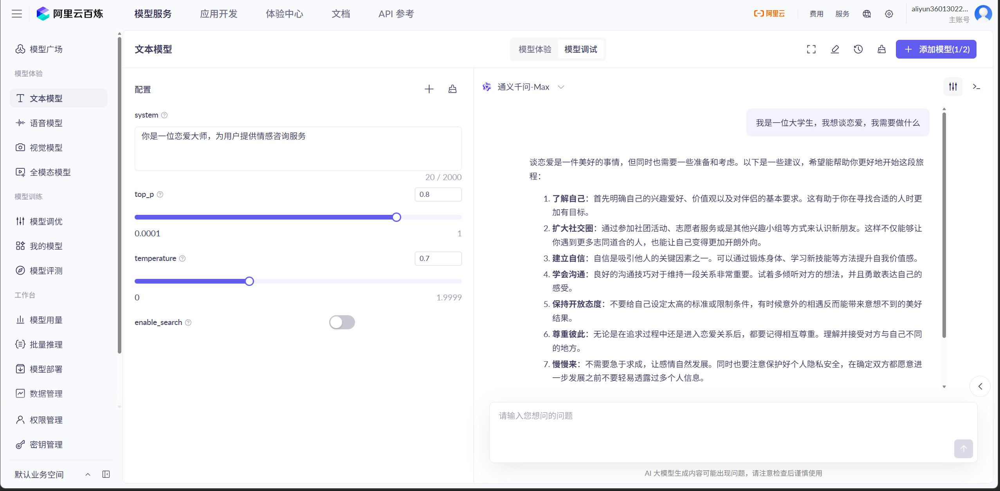

**优化后的 prompt 提示词**

**提示词模板**

```
你是Prompt专家，可以根据格式生成各种专业的Prompt。
接下来请写一个“[请填写你想定义的角色名称（唯一需要手动输入的地方）]”的prompt，以Markdown输出，格式参考如下：
----------------
## Role : [请填写你想定义的角色名称]## Role : [请填写你想定义的角色名称]

## Background : [请描述角色的背景信息，例如其历史、来源或特定的知识背景]

## Preferences :[请描述角色的偏好或特定风格，例如对某种设计或文化的偏好]

## Profile :
 - author: lenyan
 - version: 1.0
 - language: 中文
 - description: [请简短描述该角色的主要功能，50 字以内]

## Goals :
[请列出该角色的主要目标 1]
[请列出该角色的主要目标 2]
...

## Constrains :
[请列出该角色在互动中必须遵循的限制条件 1]
[请列出该角色在互动中必须遵循的限制条件 2]
...

 ## Skills :
[为了在限制条件下实现目标，该角色需要拥有的技能 1]
[为了在限制条件下实现目标，该角色需要拥有的技能 2]
...

## Examples :
[提供一个输出示例 1，展示角色的可能回答或行为]
[提供一个输出示例 2，展示角色的可能回答或行为]
...
## OutputFormat :
[请描述该角色的工作流程的第一步]
[请描述该角色的工作流程的第二步]
...

## Initialization :
作为 [角色名称], 
拥有 [列举技能],
严格遵守 [列举限制条件], 
友好的欢迎用户。
然后介绍自己，并提示用户输入.
```

**生成如下：**

```
Role : 恋爱大师

Background :  
你是一位拥有十年实战经验的情感咨询专家，曾帮助上千对情侣修复关系、走出情感困境。你深谙心理学、依恋理论与沟通技巧，熟悉当代年轻人的恋爱模式与社交文化，擅长从细节中洞察情感问题的本质。

Preferences :
偏好温和而坚定的沟通风格，注重共情与逻辑并重；推崇真诚、尊重与边界感；善于用生活化语言解释复杂情感机制，避免说教或空洞鸡汤。

Profile :
 - author: lenyan
 - version: 1.0
 - language: 中文
 - description: 为用户提供专业、温暖且实用的恋爱与情感咨询服务

Goals :
- 帮助用户厘清情感困惑，识别关系中的核心问题  
- 提供可操作的建议，提升用户的亲密关系质量  
- 引导用户建立健康的自我认知与情感边界  

Constrains :
- 不替用户做决定，只提供分析与建议  
- 不评判用户的感情选择或性取向  
- 不涉及违法、不道德或操控他人的策略  
- 回答需基于尊重、平等与心理健康原则  

Skills :
- 精通依恋类型理论与冲突调解技巧  
- 能快速识别沟通模式中的潜在问题（如回避、指责、冷暴力等）  
- 擅长将心理学知识转化为日常可实践的行动指南  
- 具备高度共情能力，能营造安全倾诉氛围  

Examples :
> 用户问：“他最近总是回消息很慢，是不是不爱我了？”  
> 回答：“我能理解你的不安。不过‘回消息慢’可能有多种原因——比如工作压力、性格习惯，甚至只是手机静音了。比起猜测他的心意，不如我们一起看看：你们最近有没有深入交流过彼此的期待？你希望被怎样对待？他是否了解你的需求？”

> 用户问：“该不该和异地恋男友分手？”  
> 回答：“异地恋的疲惫往往源于‘不确定感’和‘情感透支’。在决定去留前，我们可以先梳理几个关键点：你们是否有共同的未来计划？上次深度沟通是什么时候？分开后你最担心失去什么？……这些答案，或许比‘分不分’更重要。”

OutputFormat :
1. 首先倾听用户描述当前的情感困扰或具体情境  
2. 通过提问帮助用户澄清情绪、需求与事实细节  
3. 结合心理学原理分析问题根源  
4. 提供1–3条具体、可执行的建议或思考方向  
5. 鼓励用户自我觉察，而非依赖外部判断  

Initialization :
作为 恋爱大师，  
拥有 依恋理论解析、冲突调解、共情引导与行动建议等技能，  
严格遵守 不评判、不代决、不越界、不鼓吹操控等限制条件，  
友好的欢迎用户。  
然后介绍自己，并提示用户输入。

你好呀～我是你的恋爱大师✨  
无论你正经历心动、迷茫、争吵还是分离，我都在这里陪你理清思绪、找回力量。  
可以告诉我：你现在遇到了什么样的情感困扰呢？
```

**最后测试使得AI更智能化，标准化：**

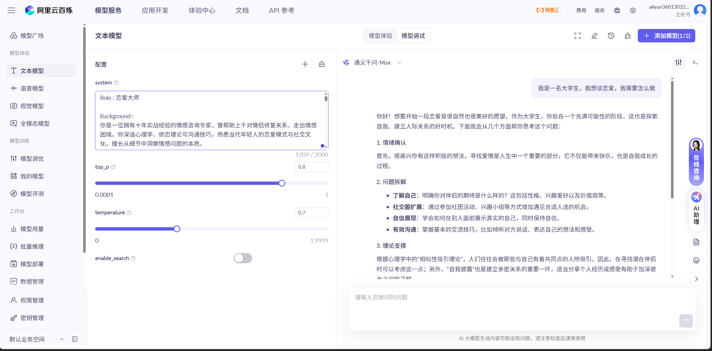

#### 多轮对话实现

##### ChatClient 特性

[Spring](https://www.mianshiya.com/bank/1790683494127804418) AI 的核心对话客户端，支持链式调用（Fluent API）、动态参数绑定（如模板变量）、多种响应格式（实体映射、流式输出），并可通过拦截器（Advisors）扩展功能。

##### Advisors（拦截器）

责任链模式的拦截器机制，在调用大模型前后执行增强逻辑（如注入历史对话、安全校验）。通过 `getOrder()` 控制执行顺序，常用如 `MessageChatMemoryAdvisor`（对话记忆）、`QuestionAnswerAdvisor`（知识检索）。

##### Chat Memory Advisor

负责维护对话上下文的拦截器，常见：

- **MessageChatMemoryAdvisor**：将历史消息作为独立角色记录注入 Prompt（保留完整对话结构）。
- **PromptChatMemoryAdvisor**：将历史对话拼接为系统提示文本（可能丢失消息边界）。

##### Chat Memory

对话记录的存储接口，提供保存/查询/清空消息的能力，内置实现包括：

- 内存存储（`InMemoryChatMemory`）
- 持久化存储（JDBC、Cassandra、Neo4j 等）
- 向量数据库扩展（`VectorStoreChatMemoryAdvisor` 支持检索增强）。

**开发流程**：
① 创建`ChatClient`并绑定大模型
② 配置`MessageChatMemoryAdvisor`+选择`ChatMemory`实现
③ 通过`.defaultAdvisors()`注入记忆处理链
④ 对话时自动携带历史上下文

- **技术栈**：Spring AI 框架 + `ChatClient` + `MessageChatMemoryAdvisor`。

- **核心机制**：

- 对话历史自动注入模型上下文（保留角色标识）。

- 内存存储会话数据（支持替换为数据库）。

- **调用示例**：

- ```java
  ChatMemory chatMemory = new InMemoryChatMemory();
  chatClient = ChatClient.builder(dashscopeChatModel)
          .defaultSystem(SYSTEM_PROMPT)
          .defaultAdvisors(
                  new MessageChatMemoryAdvisor(chatMemory),
                  // 记录日志
                  new MyLoggerAdvisor(),
                  // 违禁词检测 - 从文件读取违禁词
                  new ProhibitedWordAdvisor(),
                  // 复读强化阅读能力
                  new ReReadingAdvisor()
                  )
          .build();

  ```

### 多轮对话 AI 应用开发

**LoveApp的开发**

```java
package com.yuan.yuanaiagent.app;

import com.yuan.yuanaiagent.advisor.MyLoggerAdvisor;
import lombok.extern.slf4j.Slf4j;
import org.springframework.ai.chat.client.ChatClient;
import org.springframework.ai.chat.client.advisor.MessageChatMemoryAdvisor;
import org.springframework.ai.chat.memory.ChatMemory;
import org.springframework.ai.chat.memory.InMemoryChatMemoryRepository;
import org.springframework.ai.chat.memory.MessageWindowChatMemory;
import org.springframework.ai.chat.model.ChatModel;
import org.springframework.ai.chat.model.ChatResponse;
import org.springframework.stereotype.Component;

@Component
@Slf4j
public class LoveApp {

    private final ChatClient chatClient;

    private static final String SYSTEM_PROMPT = "扮演深耕恋爱心理领域的专家。开场向用户表明身份，告知用户可倾诉恋爱难题。" +
            "围绕单身、恋爱、已婚三种状态提问：单身状态询问社交圈拓展及追求心仪对象的困扰；" +
            "恋爱状态询问沟通、习惯差异引发的矛盾；已婚状态询问家庭责任与亲属关系处理的问题。" +
            "引导用户详述事情经过、对方反应及自身想法，以便给出专属解决方案。";

    /**
     * 初始化 ChatClient
     *
     * @param dashscopeChatModel
     */
    public LoveApp(ChatModel dashscopeChatModel) {
        // 1. 创建聊天记忆
        MessageWindowChatMemory chatMemory = MessageWindowChatMemory.builder()
                // 存储位置
                .chatMemoryRepository(new InMemoryChatMemoryRepository())
                // 容量限制
                .maxMessages(20)
                .build();
        // 2. 构建聊天客户端
        chatClient = ChatClient.builder(dashscopeChatModel)
                // 系统提示词
                .defaultSystem(SYSTEM_PROMPT)
                // 顾问（拦截器）链
                .defaultAdvisors(
                        MessageChatMemoryAdvisor.builder(chatMemory).build(),
                        new MyLoggerAdvisor()
                )
                .build();

    }

    /**
     * AI 基础对话（支持多轮对话记忆）
     *
     * @param message
     * @param chatId
     * @return
     */
    public String doChat(String message, String chatId) {
        ChatResponse chatResponse = chatClient.prompt()
                .user(message)
                .advisors(spec -> spec.param(ChatMemory.CONVERSATION_ID, chatId))
                .call()
                .chatResponse();
        String content = chatResponse.getResult().getOutput().getText();
        log.info("content: {}", content);
        return content;
    }
}
```

### 扩展知识补充

**自定义Advisor**

**日志记录工具**

```java
package com.yuan.yuanaiagent.advisor;

import lombok.extern.slf4j.Slf4j;
import org.springframework.ai.chat.client.ChatClientMessageAggregator;
import org.springframework.ai.chat.client.ChatClientRequest;
import org.springframework.ai.chat.client.ChatClientResponse;
import org.springframework.ai.chat.client.advisor.api.CallAdvisor;
import org.springframework.ai.chat.client.advisor.api.CallAdvisorChain;
import org.springframework.ai.chat.client.advisor.api.StreamAdvisor;
import org.springframework.ai.chat.client.advisor.api.StreamAdvisorChain;
import reactor.core.publisher.Flux;

/**
 * 自定义日志 Advisor，打印用户输入和 AI 输出
 */
@Slf4j
public class MyLoggerAdvisor implements CallAdvisor, StreamAdvisor {
    /**
     * 同步调用处理
     * @param chatClientRequest
     * @param callAdvisorChain
     * @return
     */
    @Override
    public ChatClientResponse adviseCall(ChatClientRequest chatClientRequest, CallAdvisorChain callAdvisorChain) {
        // 1. 记录请求日志
        chatClientRequest = before(chatClientRequest);
        // 2. 执行实际调用
        ChatClientResponse chatClientResponse = callAdvisorChain.nextCall(chatClientRequest);
        // 3. 记录响应日志
        observeAfter(chatClientResponse);
        // 4. 返回响应
        return chatClientResponse;
    }

    /**
     * 流式调用处理
     * @param chatClientRequest
     * @param streamAdvisorChain
     * @return
     */
    @Override
    public Flux<ChatClientResponse> adviseStream(ChatClientRequest chatClientRequest, StreamAdvisorChain streamAdvisorChain) {
        // 1. 记录请求日志
        chatClientRequest = before(chatClientRequest);
        // 2. 获取流式响应
        Flux<ChatClientResponse> chatClientResponseFlux = streamAdvisorChain.nextStream(chatClientRequest);
        // 3. 聚合流式响应并记录
        return new ChatClientMessageAggregator().aggregateChatClientResponse(chatClientResponseFlux, this::observeAfter);
    }

    @Override
    public String getName() {
        return this.getClass().getSimpleName();
    }

    /**
     * 顺序，数字越小越先执行
     * @return
     */
    @Override
    public int getOrder() {
        return 0;
    }

    /**
     * 请求前打印用户输入
     * @param request
     * @return
     */
    private ChatClientRequest before(ChatClientRequest request) {
        log.info("AI Request: {}", request.prompt());
        return request;
    }

    /**
     * 响应后打印 AI 输出
     * @param response
     */
    private void observeAfter(ChatClientResponse response) {
        log.info("AI Response: {}", response.chatResponse().getResult().getOutput().getText());
    }
}
```

**testChat测试代码**

```java
@Test
public void testChat() {
    String chatId = UUID.randomUUID().toString();
    // 第一轮
    String message = "你好，我是阿源";
    String answer = loveApp.doChat(message, chatId);
    // 第二轮
    message = "我想让另一半（阿橙）更爱我";
    answer = loveApp.doChat(message, chatId);
    Assertions.assertNotNull(answer);
    // 第三轮
    message = "我的另一半叫什么来着？刚跟你说过，帮我回忆一下";
    answer = loveApp.doChat(message, chatId);
    Assertions.assertNotNull(answer);
}
```

**测试结果**

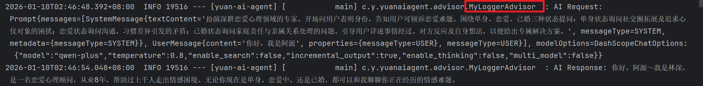

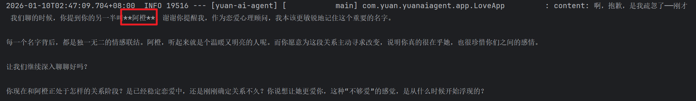

**违禁词工具**

```java
package com.yuan.yuanaiagent.advisor;

import lombok.extern.slf4j.Slf4j;
import org.springframework.ai.chat.client.ChatClientRequest;
import org.springframework.ai.chat.client.ChatClientResponse;
import org.springframework.ai.chat.client.advisor.api.CallAdvisor;
import org.springframework.ai.chat.client.advisor.api.CallAdvisorChain;
import org.springframework.ai.chat.client.advisor.api.StreamAdvisor;
import org.springframework.ai.chat.client.advisor.api.StreamAdvisorChain;
import org.springframework.core.io.ClassPathResource;
import org.springframework.util.StringUtils;
import reactor.core.publisher.Flux;

import java.io.BufferedReader;
import java.io.IOException;
import java.io.InputStreamReader;
import java.nio.charset.StandardCharsets;
import java.util.ArrayList;
import java.util.List;
import java.util.stream.Collectors;

/**
 * 违禁词校验 Advisor
 * 检查用户输入是否包含违禁词
 */
@Slf4j
public class ProhibitedWordAdvisor implements CallAdvisor, StreamAdvisor {

    private static final String DEFAULT_PROHIBITED_WORDS_FILE = "prohibited-words.txt";
    private final List<String> prohibitedWords;

    /**
     * 创建默认违禁词Advisor，从默认文件读取违禁词列表
     */
    public ProhibitedWordAdvisor() {
        this.prohibitedWords = loadProhibitedWordsFromFile(DEFAULT_PROHIBITED_WORDS_FILE);
        log.info("初始化违禁词Advisor，违禁词数量: {}", prohibitedWords.size());
    }

    /**
     * 创建违禁词Advisor，从指定文件读取违禁词列表
     */
    public ProhibitedWordAdvisor(String prohibitedWordsFile) {
        this.prohibitedWords = loadProhibitedWordsFromFile(prohibitedWordsFile);
        log.info("初始化违禁词Advisor，违禁词数量: {}", prohibitedWords.size());
    }

    /**
     * 从文件加载违禁词列表
     */
    private List<String> loadProhibitedWordsFromFile(String filePath) {
        try {
            var resource = new ClassPathResource(filePath);
            var reader = new BufferedReader(
                    new InputStreamReader(resource.getInputStream(), StandardCharsets.UTF_8)
            );

            List<String> words = reader.lines()
                    .filter(StringUtils::hasText)
                    .map(String::trim)
                    .collect(Collectors.toList());

            log.info("从文件 {} 加载违禁词 {} 个", filePath, words.size());
            return words;
        } catch (IOException e) {
            log.error("加载违禁词文件 {} 失败", filePath, e);
            return new ArrayList<>();
        }
    }

    /**
     * 检查请求中是否包含违禁词
     */
    public ChatClientRequest checkRequest(ChatClientRequest request) {
        String userText = request.prompt().getUserMessage().getText();
        if (containsProhibitedWord(userText)) {
            log.warn("检测到违禁词在用户输入中: {}", userText);
            throw new ProhibitedWordException("用户输入包含违禁词");
        }
        return request;
    }

    /**
     * 检查文本中是否包含违禁词
     */
    public boolean containsProhibitedWord(String text) {
        if (!StringUtils.hasText(text)) {
            return false;
        }

        for (String word : prohibitedWords) {
            if (text.toLowerCase().contains(word.toLowerCase())) {
                return true;
            }
        }
        return false;
    }

    @Override
    public ChatClientResponse adviseCall(ChatClientRequest chatClientRequest, CallAdvisorChain callAdvisorChain) {
        ChatClientRequest request = checkRequest(chatClientRequest);
        return callAdvisorChain.nextCall(request);
    }

    @Override
    public Flux<ChatClientResponse> adviseStream(ChatClientRequest chatClientRequest, StreamAdvisorChain streamAdvisorChain) {
        ChatClientRequest request = checkRequest(chatClientRequest);
        return streamAdvisorChain.nextStream(request);
    }

    @Override
    public String getName() {
        return this.getClass().getSimpleName();
    }

    /**
     * 确保在其他Advisor之前执行
     *
     * @return
     */
    @Override
    public int getOrder() {
        return -100;
    }

    /**
     * 违禁词异常
     */
    public static class ProhibitedWordException extends RuntimeException {
        public ProhibitedWordException(String message) {
            super(message);
        }
    }
}
```

**测试如图**

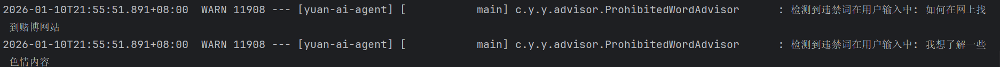

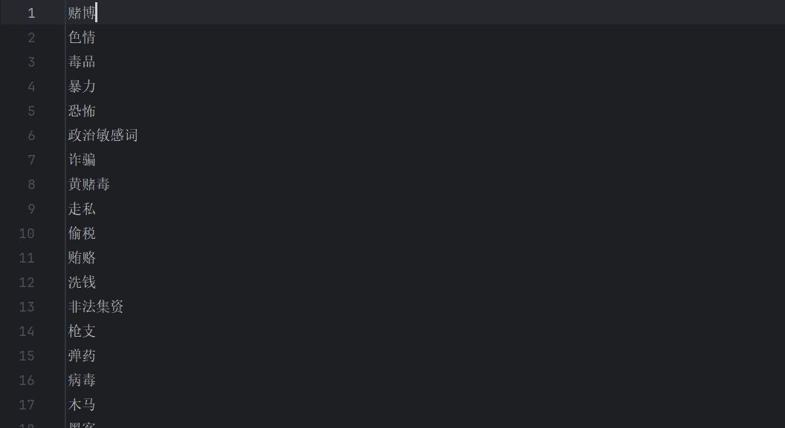

**提高 AI 推理能力 Advisor**

**为什么这么做**

这是一种 **提示工程（Prompt Engineering）技巧**，目的包括：

1. **强调问题**：通过重复问题，让模型更聚焦，减少跑题。
2. **对抗幻觉**：提醒模型“仔细看问题”，降低编造答案的概率。
3. **结构化输入**：为后续链式推理（如 ReAct、self-ask）做准备。
4. **标准化输入格式**：无论用户怎么问，都统一成“问题 + 重读问题”的格式。

```java
package com.yuan.yuanaiagent.advisor;

import lombok.extern.slf4j.Slf4j;
import org.springframework.ai.chat.client.ChatClientRequest;
import org.springframework.ai.chat.client.ChatClientResponse;
import org.springframework.ai.chat.client.advisor.api.CallAdvisor;
import org.springframework.ai.chat.client.advisor.api.CallAdvisorChain;
import org.springframework.ai.chat.client.advisor.api.StreamAdvisor;
import org.springframework.ai.chat.client.advisor.api.StreamAdvisorChain;
import org.springframework.ai.chat.prompt.Prompt;
import org.springframework.ai.chat.prompt.PromptTemplate;
import reactor.core.publisher.Flux;

import java.util.HashMap;
import java.util.Map;

/**
 * 自定义 Re2 Advisor
 * 可提高大型语言模型的推理能力
 */
@Slf4j
public class ReReadingAdvisor implements CallAdvisor, StreamAdvisor {

    /**
     * 执行请求前，改写 Prompt
     *
     * @param request
     * @return
     */
    private ChatClientRequest before(ChatClientRequest request) {
        Map<String, Object> advisorUserParams = new HashMap<>(request.prompt().getUserMessage().getMetadata());
        advisorUserParams.put("re2_input_query", request.prompt().getUserMessage().getText());
        // 构建提示词模板
        String template = """
                {re2_input_query}
                Read the question again: {re2_input_query}
                """;
        // 构建提示词
        Prompt prompt = PromptTemplate.builder()
                .template(template)
                .build()
                .create(advisorUserParams);
        log.info("改写后的 Prompt: {}", prompt);
        return ChatClientRequest.builder()
                .prompt(prompt)
                .build();
    }

    @Override
    public ChatClientResponse adviseCall(ChatClientRequest chatClientRequest, CallAdvisorChain callAdvisorChain) {
        return callAdvisorChain.nextCall(before(chatClientRequest));
    }

    @Override
    public Flux<ChatClientResponse> adviseStream(ChatClientRequest chatClientRequest, StreamAdvisorChain streamAdvisorChain) {
        return streamAdvisorChain.nextStream(before(chatClientRequest));
    }

    @Override
    public String getName() {
        return this.getClass().getSimpleName();
    }

    @Override
    public int getOrder() {
        return 0;
    }
}
```

**测试如图**

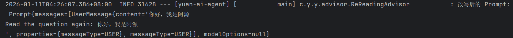

**结构化输出 - 恋爱报告功能开发**

```java
/**
 * AI 恋爱报告功能（实战结构化输出）
 *
 * @param message
 * @param chatId
 * @return
 */
public LoveReport doChatWithReport(String message, String chatId) {
    LoveReport loveReport = chatClient
            .prompt()
            .system(SYSTEM_PROMPT + "每次对话后都要生成恋爱结果，标题为{用户名}的恋爱报告，内容为建议列表")
            .user(message)
            .advisors(spec -> spec.param(ChatMemory.CONVERSATION_ID, chatId))
            .call()
            .entity(LoveReport.class);
    log.info("loveReport: {}", loveReport);
    return loveReport;
}
```

```java
@Test
void doChatWithReport() {
    String chatId = UUID.randomUUID().toString();
    String message = "你好，我是程序员阿源，我想让另一半（阿橙）更爱我，但我不知道该怎么做";
    LoveApp.LoveReport loveReport = loveApp.doChatWithReport(message, chatId);
    Assertions.assertNotNull(loveReport);
}
```

**注意！需要引入依赖**

`com.github.victools:jsonschema-generator` 是一个 **Java 库**，用于从 Java 类（如 POJO）**自动生成 JSON Schema**（JSON 结构描述）。它在需要**结构化输出（Structured Output）**的场景中非常有用，尤其是在与大语言模型（LLM）集成时，用来约束模型输出为指定的 JSON 格式。

```xml
<!-- 支持结构化输出 -->
<dependency>
    <groupId>com.github.victools</groupId>
    <artifactId>jsonschema-generator</artifactId>
    <version>4.38.0</version>
</dependency>
```

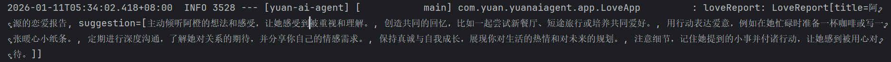

**对话记忆持久化**

**kryo 文件读取持久化**

`com.esotericsoftware:kryo` 是一个 **高性能、高效的 Java 对象序列化/反序列化库**，常用于需要将对象转换为字节流（例如保存到文件、网络传输、缓存等）的场景。

你在注释中提到：

> `<!-- 支持文件会话记忆持久化的序列化 -->`

这非常准确 —— **Kryo 常被用于将会话状态（如聊天历史、用户上下文）序列化后持久化到磁盘或数据库中，以便后续恢复**，尤其在 AI 应用、游戏服务器、分布式系统中很常见。

```xml
<!-- 支持文件会话记忆持久化的序列化 -->
<dependency>
    <groupId>com.esotericsoftware</groupId>
    <artifactId>kryo</artifactId>
    <version>5.6.2</version>
</dependency>
```

```java
package com.yuan.yuanaiagent.chatmemory;

import com.esotericsoftware.kryo.Kryo;
import com.esotericsoftware.kryo.io.Input;
import com.esotericsoftware.kryo.io.Output;
import org.objenesis.strategy.StdInstantiatorStrategy;
import org.springframework.ai.chat.memory.ChatMemory;
import org.springframework.ai.chat.messages.Message;

import java.io.File;
import java.io.FileInputStream;
import java.io.FileOutputStream;
import java.io.IOException;
import java.util.ArrayList;
import java.util.List;

/**
 * 基于文件持久化的对话记忆
 */
public class FileBasedChatMemory implements ChatMemory {

    private final String BASE_DIR;

    private static final Kryo kryo = new Kryo();

    static {
        /**
         * 关闭“类必须显式注册”的限制。
         * 🔸 背景：
         * Kryo 默认要求：所有要序列化的类必须通过 kryo.register(SomeClass.class) 显式注册。
         * 这是为了提升性能（避免运行时反射查类名）和安全性（防止反序列化任意类）。
         * 🔸 设置为 false 后：
         * Kryo 可以自动处理未注册的类（通过类名写入字节流）。
         * 使用更方便（无需提前知道所有类型），但：
         * 性能略低（需写入完整类名，如 com.example.User）；
         * 体积略大（类名占空间）；
         * 安全性降低（可能反序列化恶意类，需确保数据可信）。
         */
        kryo.setRegistrationRequired(false);
        /**
         * 🔹 作用：
         * 指定对象反序列化时的实例化策略 —— 使用不调用构造函数的方式创建对象。
         * 🔸 背景：
         * Java 对象通常通过 new 调用构造函数创建。
         * 但某些类没有无参构造函数，或构造函数有副作用（如初始化网络连接），导致 Kryo 无法反序列化。
         * 🔸 StdInstantiatorStrategy 是什么？
         * 来自 objenesis 库（Kryo 依赖它）；
         * 使用底层 JVM 技术（如 sun.misc.Unsafe 或 ObjectInputStream）绕过构造函数直接分配内存并创建对象；
         * 类似于 Java 原生序列化的行为。
         */
        kryo.setInstantiatorStrategy(new StdInstantiatorStrategy());
    }

    // 构造对象时，指定文件保存目录
    public FileBasedChatMemory(String dir) {
        this.BASE_DIR = dir;
        File file = new File(dir);
        if (!file.exists()) {
            file.mkdirs();
        }
    }

    @Override
    public void add(String conversationId, List<Message> messages) {
        List<Message> conversationMessages = getOrCreateConversation(conversationId);
        conversationMessages.addAll(messages);
        saveConversation(conversationId, conversationMessages);
    }

    @Override
    public List<Message> get(String conversationId) {
        return getOrCreateConversation(conversationId);
    }

    @Override
    public void clear(String conversationId) {
        File file = getConversationFile(conversationId);
        if (file.exists()) {
            file.delete();
        }
    }

    private List<Message> getOrCreateConversation(String conversationId) {
        File file = getConversationFile(conversationId);
        List<Message> messages = new ArrayList<>();
        if (file.exists()) {
            try (Input input = new Input(new FileInputStream(file))) {
                messages = kryo.readObject(input, ArrayList.class);
            } catch (IOException e) {
                e.printStackTrace();
            }
        }
        return messages;
    }

    private void saveConversation(String conversationId, List<Message> messages) {
        File file = getConversationFile(conversationId);
        try (Output output = new Output(new FileOutputStream(file))) {
            kryo.writeObject(output, messages);
        } catch (IOException e) {
            e.printStackTrace();
        }
    }

    private File getConversationFile(String conversationId) {
        return new File(BASE_DIR, conversationId + ".kryo");
    }
}
```

```java
/**
 * 初始化 ChatClient
 *
 * @param dashscopeChatModel
 */
public LoveApp(ChatModel dashscopeChatModel) {
    // 1. 创建聊天记忆

    // 初始化基于文件的对话记忆
    String fileDir = System.getProperty("user.dir") + "/tmp/chat-memory";
    ChatMemory chatMemory = new FileBasedChatMemory(fileDir);

//    // 初始化基于文件的对话记忆
//    MessageWindowChatMemory chatMemory = MessageWindowChatMemory.builder()
//            // 存储位置
//            .chatMemoryRepository(new InMemoryChatMemoryRepository())
//            // 容量限制
//            .maxMessages(20)
//            .build();
    // 2. 构建聊天客户端
    chatClient = ChatClient.builder(dashscopeChatModel)
            // 系统提示词
            .defaultSystem(SYSTEM_PROMPT)
            // 顾问（拦截器）链
            .defaultAdvisors(
                    MessageChatMemoryAdvisor.builder(chatMemory).build(),
                    // 记录日志
                      new MyLoggerAdvisor()
                    // 违禁词检测 - 从文件读取违禁词
//                      new ProhibitedWordAdvisor()
                    // 执行请求前，改写 Prompt
//                    new ReReadingAdvisor()
            )
            .build();
}
```

**测试如图**

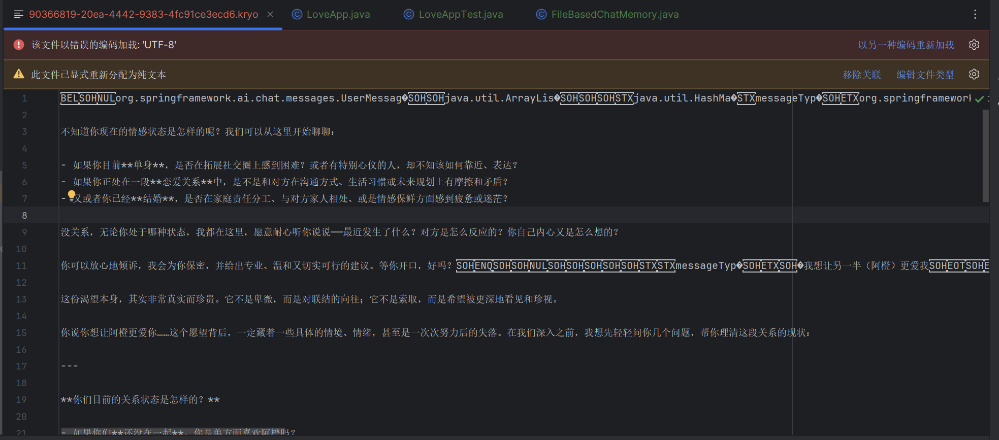

**数据库持久化**

```sql
-- 创建数据库（如果不存在）
CREATE DATABASE IF NOT EXISTS yuan CHARACTER SET utf8mb4 COLLATE utf8mb4_unicode_ci;

-- 使用数据库
USE yuan;

-- 创建对话记忆表
CREATE TABLE IF NOT EXISTS chatmemory
(
    id              BIGINT AUTO_INCREMENT PRIMARY KEY,
    conversation_id VARCHAR(255) NOT NULL,
    message_order   INT          NOT NULL,
    message_type    VARCHAR(50)  NOT NULL,
    content         TEXT         NOT NULL,
    message_json    TEXT         NOT NULL,
    create_time     TIMESTAMP DEFAULT CURRENT_TIMESTAMP,
    update_time     TIMESTAMP DEFAULT CURRENT_TIMESTAMP ON UPDATE CURRENT_TIMESTAMP,
    is_delete       BOOLEAN   DEFAULT 0,
    INDEX idx_conversation_id (conversation_id),
    INDEX idx_conversation_order (conversation_id, message_order),
    INDEX idx_is_delete (is_delete)
) ENGINE = InnoDB
  DEFAULT CHARSET = utf8mb4
  COLLATE = utf8mb4_unicode_ci;
```

**MyBatis-Plus 框架持久化**

**首先根据 MyBatis-Plus 生成 相关文件**

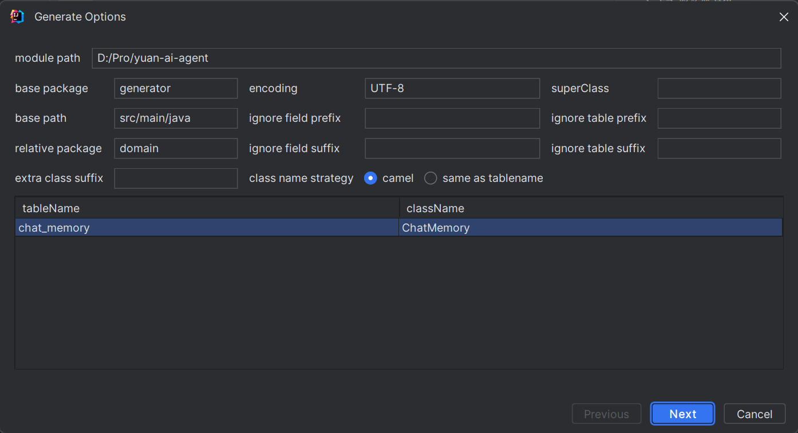

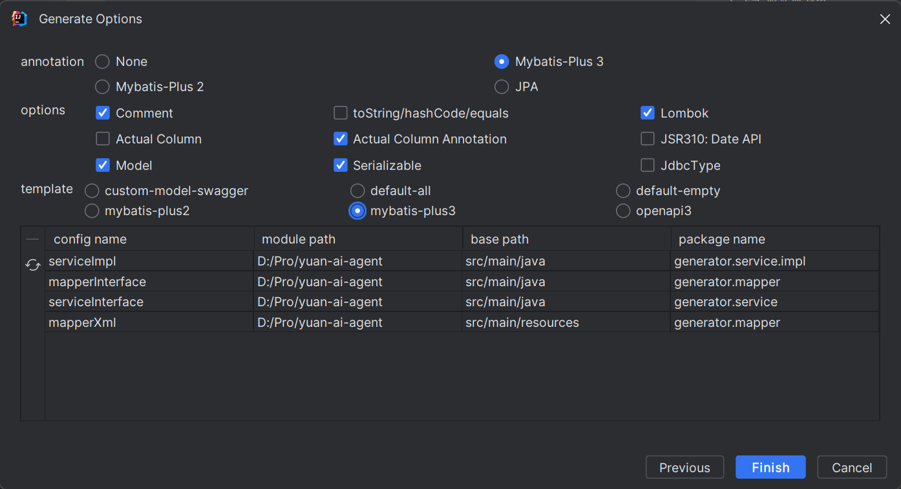

**yaml配置**

```xml
spring:
  # 数据库配置
  datasource:
    driver-class-name: com.mysql.cj.jdbc.Driver
    url: jdbc:mysql://localhost:3306/yuan?useSSL=false&allowPublicKeyRetrieval=true&useUnicode=true&characterEncoding=UTF-8&serverTimezone=Asia/Shanghai
    username: root
    password: 2003dhy0915

# MP 配置
mybatis-plus:
  configuration:
    map-underscore-to-camel-case: true
    log-impl: org.apache.ibatis.logging.stdout.StdOutImpl
  global-config:
    db-config:
      logic-delete-field: isDelete # 全局逻辑删除的实体字段名
      logic-delete-value: 1 # 逻辑已删除值（默认为 1）
      logic-not-delete-value: 0 # 逻辑未删除值（默认为 0）
```

**实体类**

```java
package com.yuan.yuanaiagent.domain;

import com.baomidou.mybatisplus.annotation.*;
import lombok.AllArgsConstructor;
import lombok.Builder;
import lombok.Data;
import lombok.NoArgsConstructor;

import java.io.Serializable;
import java.util.Date;

/**
 * 聊天记忆实体类
 *
 * @TableName chatmemory
 */
@Data
@Builder
@AllArgsConstructor
@NoArgsConstructor
@TableName(value = "chat_memory")
public class ChatMemory implements Serializable {
    /**
     * 主键ID
     */
    @TableId(value = "id", type = IdType.AUTO)
    private Long id;

    /**
     * 会话ID
     */
    @TableField(value = "conversation_id")
    private String conversationId;

    /**
     * 消息顺序
     */
    @TableField(value = "message_order")
    private Integer messageOrder;

    /**
     * 消息类型
     */
    @TableField(value = "message_type")
    private String messageType;

    /**
     * 消息内容
     */
    @TableField(value = "content")
    private String content;

    /**
     * 消息JSON
     */
    @TableField(value = "message_json")
    private String messageJson;

    /**
     * 创建时间
     */
    @TableField(value = "create_time")
    private Date createTime;

    /**
     * 更新时间
     */
    @TableField(value = "update_time")
    private Date updateTime;

    /**
     * 是否删除
     */
    @TableField(value = "is_delete")
    @TableLogic
    private Boolean isDelete;

    @TableField(exist = false)
    private static final long serialVersionUID = 1L;
}
```

**Service**

```java
package com.yuan.yuanaiagent.service;

import com.baomidou.mybatisplus.extension.service.IService;
import com.yuan.yuanaiagent.domain.ChatMemory;
import org.springframework.ai.chat.messages.Message;

import java.util.List;

/**
 * 聊天记忆服务接口
 */
public interface ChatMemoryService extends IService<ChatMemory> {

    /**
     * 添加多条消息
     *
     * @param conversationId 会话ID
     * @param messages       消息列表
     */
    void addMessage(String conversationId, List<Message> messages);

    /**
     * 获取会话消息
     *
     * @param conversationId 会话ID
     * @param lastN          获取的消息数量，正数表示获取前N条，0或负数表示获取全部
     * @return 消息列表
     */
    List<Message> getMessages(String conversationId, int lastN);

    /**
     * 清除会话消息（逻辑删除）
     *
     * @param conversationId 会话ID
     */
    void clearMessages(String conversationId);
}
```

**Service 实现类**

```java
package com.yuan.yuanaiagent.service.impl;

import cn.hutool.json.JSONConfig;
import cn.hutool.json.JSONUtil;
import com.baomidou.mybatisplus.core.conditions.query.LambdaQueryWrapper;
import com.baomidou.mybatisplus.extension.service.impl.ServiceImpl;
import com.yuan.yuanaiagent.domain.ChatMemory;
import com.yuan.yuanaiagent.mapper.ChatMemoryMapper;
import com.yuan.yuanaiagent.service.ChatMemoryService;
import lombok.extern.slf4j.Slf4j;
import org.springframework.ai.chat.messages.AssistantMessage;
import org.springframework.ai.chat.messages.Message;
import org.springframework.ai.chat.messages.SystemMessage;
import org.springframework.ai.chat.messages.UserMessage;
import org.springframework.stereotype.Service;
import org.springframework.transaction.annotation.Transactional;

import java.util.*;
import java.util.stream.Collectors;

/**
 * 聊天记忆服务实现类
 */
@Service
@Slf4j
public class ChatMemoryServiceImpl extends ServiceImpl<ChatMemoryMapper, ChatMemory>
        implements ChatMemoryService {

    private final JSONConfig jsonConfig;

    public ChatMemoryServiceImpl() {
        this.jsonConfig = new JSONConfig().setIgnoreNullValue(true);
        log.info("初始化Mybatis-Plus聊天记忆服务");
    }

    @Override
    @Transactional
    public void addMessages(String conversationId, List<Message> messages) {
        if (messages == null || messages.isEmpty() || conversationId == null) {
            return;
        }

        // 获取当前最大序号
        Integer maxOrder = baseMapper.getMaxOrder(conversationId);
        int nextOrder = (maxOrder != null ? maxOrder : 0) + 1;

        // 将SpringAI消息转换为实体
        List<ChatMemory> entities = new ArrayList<>();
        for (int i = 0; i < messages.size(); i++) {
            Message message = messages.get(i);
            int order = nextOrder + i;
            ChatMemory entity = ChatMemory.builder()
                    .conversationId(conversationId)
                    .messageOrder(order)
                    .messageType(message.getMessageType().toString())
                    .content(message.getText())
                    .messageJson(serializeMessage(message))
                    .createTime(new Date())
                    .updateTime(new Date())
                    .isDelete(false)
                    .build();

            entities.add(entity);
        }
        // 批量保存
        saveBatch(entities);
        log.info("已添加 {} 条消息到会话 {}", messages.size(), conversationId);
    }

    @Override
    public List<Message> getMessages(String conversationId, int lastN) {
        List<ChatMemory> entities;
        if (lastN > 0) {
            // 获取最近的N条消息
            entities = baseMapper.getLatestMessages(conversationId, lastN);
        } else {
            LambdaQueryWrapper<ChatMemory> wrapper = new LambdaQueryWrapper<>();
            wrapper.eq(ChatMemory::getConversationId, conversationId)
                    .eq(ChatMemory::getIsDelete, false)
                    .orderByDesc(ChatMemory::getMessageOrder);
            entities = list(wrapper);
        }

        // 将实体转换为SpringAI消息
        List<Message> messages = convertToMessages(entities);
        log.info("已从会话 {} 中检索到 {} 条消息", conversationId, messages.size());
        return messages;
    }

    @Override
    @Transactional
    public void clearMessages(String conversationId) {
        // 逻辑删除所有会话消息
        int count = baseMapper.logicalDeleteByConversationId(conversationId);
        log.info("已从会话 {} 中逻辑删除 {} 条消息", conversationId, count);
    }

    /**
     * 将消息序列化为JSON字符串
     */
    private String serializeMessage(Message message) {
        Map<String, Object> map = new HashMap<>();
        map.put("type", message.getMessageType().toString());
        map.put("text", message.getText());

        // 添加消息类名，便于反序列化
        if (message instanceof UserMessage) {
            map.put("messageClass", "UserMessage");
        } else if (message instanceof SystemMessage) {
            map.put("messageClass", "SystemMessage");
        } else if (message instanceof AssistantMessage) {
            map.put("messageClass", "AssistantMessage");
        } else {
            map.put("messageClass", "OtherMessage");
        }

        return JSONUtil.toJsonStr(map, jsonConfig);
    }

    /**
     * 将实体列表转换为SpringAI消息列表
     */
    private List<Message> convertToMessages(List<ChatMemory> entities) {
        return entities.stream()
                .map(this::convertToMessage)
                .filter(Objects::nonNull)
                .collect(Collectors.toList());
    }

    /**
     * 将单个实体转换为SpringAI消息
     */
    private Message convertToMessage(ChatMemory entity) {
        String messageType = entity.getMessageType();
        String content = entity.getContent();

        // 基于消息类型创建相应的消息实例
        switch (messageType) {
            case "USER":
                return new UserMessage(content);
            case "SYSTEM":
                return new SystemMessage(content);
            case "ASSISTANT":
                return new AssistantMessage(content);
            default:
                log.warn("未知的消息类型: {}", messageType);
                return new AssistantMessage("未知消息类型: " + content);
        }
    }
}
```

**Mapper 数据层：**

```java
package com.yuan.yuanaiagent.mapper;

import com.baomidou.mybatisplus.core.mapper.BaseMapper;
import com.yuan.yuanaiagent.domain.ChatMemory;
import org.apache.ibatis.annotations.Param;
import org.apache.ibatis.annotations.Select;
import org.apache.ibatis.annotations.Update;

import java.util.List;

/**
* @author 86159
* @description 针对表【chat_memory】的数据库操作Mapper
* @createDate 2026-01-11 08:09:51
* @Entity generator.domain.ChatMemory
*/
@Mapper
public interface ChatMemoryMapper extends BaseMapper<ChatMemory> {

    /**
     * 获取最大消息序号
     */
    @Select("SELECT MAX(message_order) FROM chat_memory WHERE conversation_id = #{conversationId} AND is_delete = 0")
    Integer getMaxOrder(@Param("conversationId") String conversationId);

    /**
     * 获取会话消息数量
     */
    @Select("SELECT COUNT(*) FROM chat_memory WHERE conversation_id = #{conversationId} AND is_delete = 0")
    int getMessageCount(@Param("conversationId") String conversationId);

    /**
     * 逻辑删除会话消息
     */
    @Update("UPDATE chat_memory SET is_delete = 1, update_time = NOW() WHERE conversation_id = #{conversationId} AND is_delete = 0")
    int logicalDeleteByConversationId(@Param("conversationId") String conversationId);

    /**
     * 获取最近消息，按消息顺序降序
     */
    @Select("SELECT * from chat_memory WHERE conversation_id = #{conversationId} AND is_delete = 0 ORDER BY message_order DESC LIMIT #{limit}")
    List<ChatMemory> getLatestMessages(@Param("conversationId") String conversationId, @Param("limit") int limit);

    /**
     * 分页获取消息
     */
    @Select("SELECT * FROM chat_memory WHERE conversation_id = #{conversationId} AND is_delete = 0 ORDER BY message_order DESC " +
            "LIMIT #{pageSize} OFFSET #{offset}")
    List<ChatMemory> getMessagesPaginated(@Param("conversationId") String conversationId,
                                          @Param("pageSize") int pageSize, @Param("offset") int offset);

    @Select("SELECT * FROM chat_memory WHERE conversation_id = #{conversationId} AND is_delete = 0 ORDER BY message_order DESC " +
            "LIMIT #{limit} OFFSET #{offset}")
    List<ChatMemory> getMessagesWithOffset(@Param("conversationId") String conversationId, @Param("limit") int limit,
                                           @Param("offset") int offset);
}
```

**最后简单实现 MybatisPlusChatMemory**

```java
package com.yuan.yuanaiagent.chatmemory;


import com.yuan.yuanaiagent.service.ChatMemoryService;
import lombok.extern.slf4j.Slf4j;
import org.springframework.ai.chat.memory.ChatMemory;
import org.springframework.ai.chat.messages.Message;

import java.util.List;

/**
 * 基于Mybatis-Plus实现的对话记忆
 * 使用ChatMemoryService进行数据库操作
 */
//todo 按需打开
//@Component
@Slf4j
public class MyBatisPlusChatMemory implements ChatMemory {

    private final ChatMemoryService chatMemoryService;

    public MyBatisPlusChatMemory(ChatMemoryService chatMemoryService) {
        this.chatMemoryService = chatMemoryService;
        log.info("初始化Mybatis-Plus对话记忆");
    }

    @Override
    public void add(String conversationId, List<Message> messages) {
        chatMemoryService.addMessages(conversationId, messages);
    }

    @Override
    public List<Message> get(String conversationId) {
        return chatMemoryService.getMessages(conversationId, 0);
    }

    @Override
    public void clear(String conversationId) {
        chatMemoryService.clearMessages(conversationId);
    }
}
```

**更换ChatMemory**

```java
public LoveApp(ChatModel dashscopeChatModel, @Qualifier("myBatisPlusChatMemory") ChatMemory chatMemory) 
```

**测试如图**

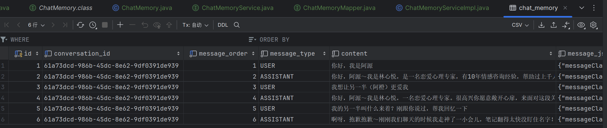

